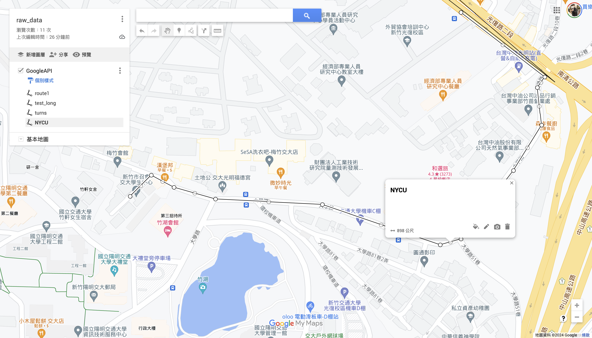

# Google Street View Image Collector

This project allows you to collect Google Street View images along a specified route using a KML file.

## Prerequisites

- Python 3.12.4
- Google API Key with Street View Static API enabled
- Google map route create [[link](https://www.google.com/maps/d/u/0/edit?mid=1IxCsVFkVPhRLRPsIhuL5nQhxf1Htpn4&ll=24.790267626542665%2C121.00130310397626&z=18)]


## Installation

1. Clone this repository:
   ```
   git clone https://github.com/muxi1998/GoogleAPI-playground.git
   cd google-street-view-collector
   ```

2. Install the required packages:
   ``` 
   pip install -r requirements.txt
   ```

3. Create a `.env` file in the project root and add your Google API key:
   ```
   GOOGLE_API_KEY=your_api_key_here
   ```

## Usage

Run the script using the following command structure:
```
python map.py -f <kml_file_path> -r <route_name> -n <num_points> -s <save_folder> -a <angle_offset>
```

### Parameters:

- `-f, --file_path`: Path to the KMZ file containing the route data
- `-r, --route_name`: Name of the route in the KML file
- `-n, --num_points`: Number of points to interpolate along the route
- `-s, --save_folder`: Folder to save the Street View images
- `-a, --angle`: Angle offset from the forward direction (0-359 degrees)
- `-d, --raw_data_path`: Path to the raw data directory (default: 'maps_raw_data')

### Example:
```
python map.py -f maps_raw_data/raw_data.kmz -r NYCU -n 10 -s ./test_0901_nycu_a30 -a 30
```

This command will:
1. Process the KMZ file located at `maps_raw_data/raw_data.kmz`
2. Extract the route named "NYCU"
3. Interpolate 10 points along the route
4. Save the Street View images in the `./test_0901_nycu_a30` folder
5. Apply a 30-degree angle offset to the image headings

## How It Works

1. The script extracts the KML data from the provided KMZ file.
2. It parses the specified route from the KML data.
3. The route is interpolated to create the desired number of points.
4. For each point, it calculates the heading based on the route direction.
5. Google Street View images are downloaded for each point with the calculated heading and specified angle offset.

## File Structure

- `map.py`: Main script for processing KML files and downloading Street View images
- `utils/kml_handler.py`: Utility functions for parsing KML files and interpolating coordinates
- `requirements.txt`: List of required Python packages
- `.env`: File containing the Google API key (not included in the repository)

## References
https://rrwen.github.io/google_streetview/
https://developers.google.com/maps/documentation/streetview/overview?hl=zh-tw